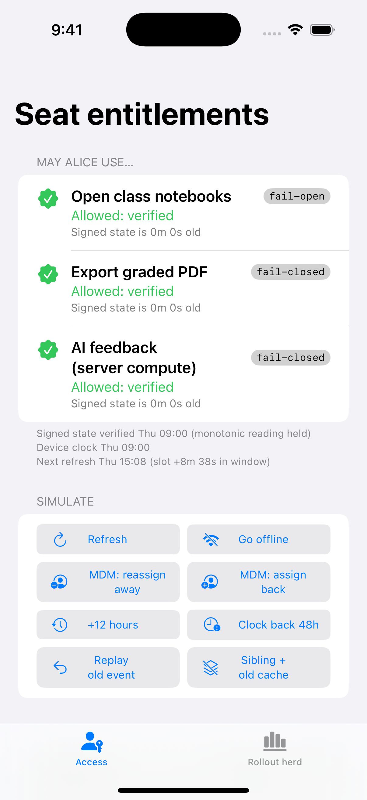
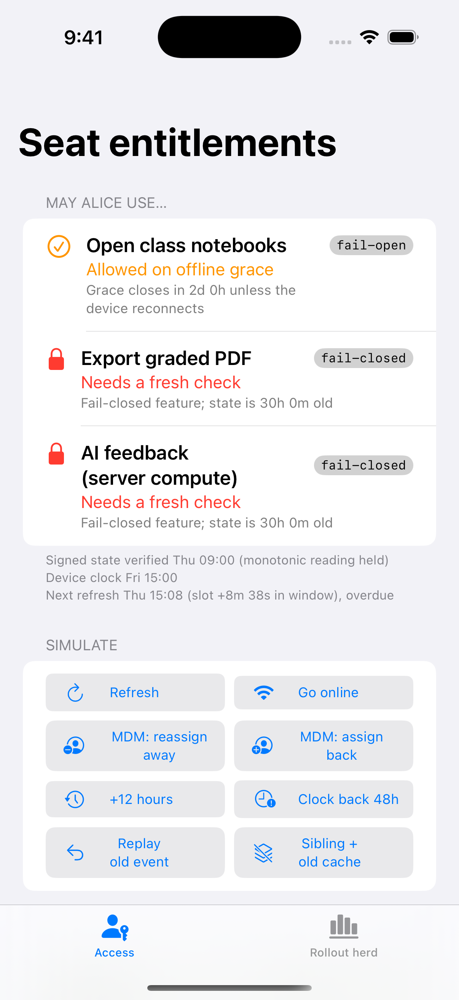
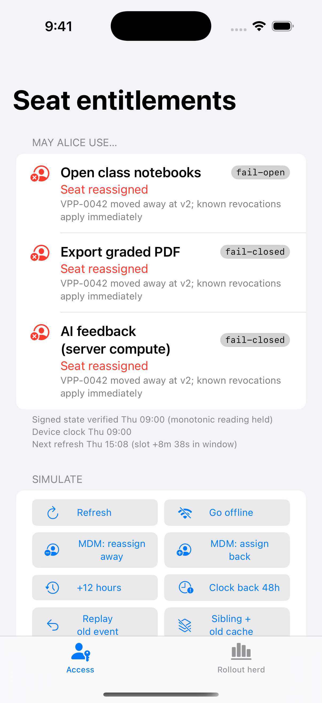
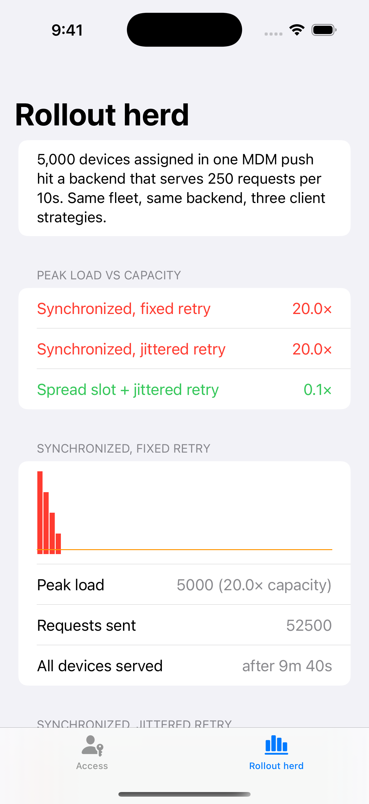

# Seat Console: SeatEntitlements demo app

**A school's iPad cart goes offline on Friday. Over the weekend, MDM moves Alice's seat to Carol. What should Alice's iPad let her do on Monday morning, and for how long?** This app turns that question, and the clock, cache and fleet-scale questions behind it, into something you can tap through and watch.

It is the runnable companion to **[SeatEntitlements](https://github.com/rajatslakhina/seat-entitlement-kit)**, a seat-aware entitlement service for iOS multiseat / Volume Purchasing subscriptions and Suites. The app consumes the library as a **remote Swift package pinned to a release** (`upToNextMajorVersion` from `1.1.0`), the way a real team would. It is never a local path or a branch.

  
  
  
  

From left to right: verified · 30 h offline after an undelivered MDM reassignment (fail-open on grace, fail-closed blocked) · reassignment pushed while online (revoked at once) · rollout herd (peak vs capacity: 20× / 20× / 0.1×). These are real Simulator screenshots, captured by this repo's CI on a GitHub-hosted macOS runner and refreshed on every push to `main` (see Verification).

## Why this matters

Volume Purchasing for subscriptions (seats bought by an organisation and assigned by MDM) goes live on 22 October 2026, and Suites share one subscription across up to 15 apps. The business flow is documented; the device-side behaviour when a seat moves is not. Someone has to decide:

- how long a revoked seat may keep working offline;
- which features fail open and which fail closed;
- what happens when a device clock is wrong;
- what stops a restored backup bringing a seat back;
- how 5,000 devices avoid refreshing on the same second.

This app puts every one of those decisions on screen, with the reason for each answer.

## What you can do in it

**Access tab.** Alice (`ipad-cart-07`) has three features from the `com.example.classroom.pro` Suite. Each row shows the live `Decision` from `EntitlementResolver.decide(_:)` and the reason behind it:

| Feature | Failure mode | Meaning |
| --- | --- | --- |
| Open class notebooks | fail-open | keeps working offline for up to 72 h past freshness |
| Export graded PDF | fail-closed | needs state verified in the last 6 h |
| AI feedback (server compute) | fail-closed | needs state verified in the last 6 h |

Buttons:

| Button | What it shows |
| --- | --- |
| **Refresh** | A real ES256-signed snapshot is fetched from a simulated backend, verified, merged into the ledger and shared with Suite siblings. |
| **Go offline / online** | Refreshes fail, and pushes are not delivered. |
| **MDM: reassign away** | Seat `VPP-0042` moves to Carol at a new version. Online, the push lands and every row turns red at once (*known revocations apply immediately*). Offline, nothing arrives. |
| **MDM: assign back** | Gives the seat back to Alice (a no-op if she already holds it). |
| **+12 hours** | Time passes in 12 h steps. After the first step, fail-closed features are blocked (they need state verified within 6 h) and fail-open ones count down their grace window. |
| **Clock back 48h / Restore clock** | Rewinds the device clock, as a user could in Settings, and puts it right again. Decisions do not loosen, because age uses the device's wall-clock floor and monotonic uptime. A successful **Refresh** while the clock is wrong still counts as fresh: a network-verified snapshot is aged from its receipt on the device's own clock. |
| **Replay old event** | Redelivers the original v1 grant, as a flaky push channel would. The ledger ignores it. |
| **Sibling + old cache** | A Suite sibling launches with a restored, older copy of the shared cache. The device's high-water mark refuses it. |

The ledger section shows every seat with its version and source. The event log explains each step.

**Rollout herd tab.** Runs `HerdSimulator` for 5,000 devices against a backend serving 250 requests per 10 s, with three client strategies. The result: peak load is 20× capacity for both synchronized strategies, and 0.1× with the deterministic refresh slot. Red bars are over capacity; the orange line is capacity.

### Scripted launch states

The scheme carries these as disabled launch arguments, so you can switch them on in **Edit Scheme → Run → Arguments**. CI uses the same ones for the screenshots.

| Argument | Lands on |
| --- | --- |
| `-scenario fresh` (default) | One refresh; everything verified. |
| `-scenario offlineReassign` | Refresh, go offline, MDM reassigns the seat (push not delivered), 30 h pass. Notebooks run on grace (48 h left); export and AI are blocked. |
| `-scenario onlineRevoke` | The reassignment push lands online; every feature shows *Seat reassigned*. |
| `-tab herd` | Opens on the Rollout herd tab. |

## How to run it

1. `git clone https://github.com/rajatslakhina/seat-entitlement-kit-demo-app.git`
2. Open `Demo.xcodeproj` in Xcode 16 or later. Xcode resolves `seat-entitlement-kit` from GitHub at the pinned release (1.1.0 or a later 1.x).
3. Select the **Demo** scheme and any iPhone or iPad Simulator running iOS 17 or later.
4. Build & Run (⌘R).

No signing team is needed for the Simulator. The project has no other dependencies.

## How it is wired

- `Demo/DemoApp.swift`: the `@main` app. It owns every product decision the library leaves open: the features and their failure modes, the `GracePolicy` (6 h fresh + 72 h offline grace, so a worst-case offline revocation latency of 78 h), the `RefreshScheduler` (6 h interval, 1 h spread window, 30 s → 10 min full-jitter backoff), the seat roster and the herd scenario. It passes them to `SeatConsoleView` from the library's `SeatEntitlementsUI` product.
- `Demo.xcodeproj`: one app target. `XCRemoteSwiftPackageReference` points at `https://github.com/rajatslakhina/seat-entitlement-kit.git`, `upToNextMajorVersion` from `1.1.0`, and links both `SeatEntitlements` and `SeatEntitlementsUI`. `GENERATE_INFOPLIST_FILE = YES`, and a shared `Demo` scheme is committed.
- `Scripts/simulator-screenshots.sh`: builds for a real Simulator device, installs, launches the four scripted states, checks the app is still running after each, and captures screenshots.

## Verification

What was actually done, stated separately:

- **Builds against the released package (CI, job "Resolve remote package and build").** On `macos-15`, `xcodebuild -resolvePackageDependencies` resolves `seat-entitlement-kit` from GitHub at the pinned release. The resolved version is printed from `Package.resolved`, then `xcodebuild build -scheme Demo -destination 'generic/platform=iOS Simulator'` runs. Green.
- **Ran on an iOS Simulator (CI, job "Install, launch and screenshot").** On the same runner image, `Scripts/simulator-screenshots.sh` picks an iPhone simulator matching the installed iOS Simulator SDK (iOS 18.5, iPhone 16 Pro on the first run). It then builds, installs, launches the app in each of the four scripted states, checks the process is still alive after each scenario has played out, and captures the screenshots above. The PNGs are committed back by the workflow and uploaded as a run artifact.
- **Not run on the author's own Mac.** The scheduled job that builds these repos was granted Simulator/Xcode access on the author's Mac, but Xcode had an unrelated real project open, so it deliberately did not touch it. Nobody has tapped through the buttons by hand. The screenshots show the four *scripted* states. The library behaviour each button drives is covered by the library's core tests. The console model itself (`SeatConsoleModel`) and the buttons have no automated tests.
- The library's own verification (96 Linux / 97 macOS XCTests, 27 killed mutations, warnings-as-errors builds) is described in [its README](https://github.com/rajatslakhina/seat-entitlement-kit#verification).

Current status of every job: [Actions](https://github.com/rajatslakhina/seat-entitlement-kit-demo-app/actions).

## License

MIT
